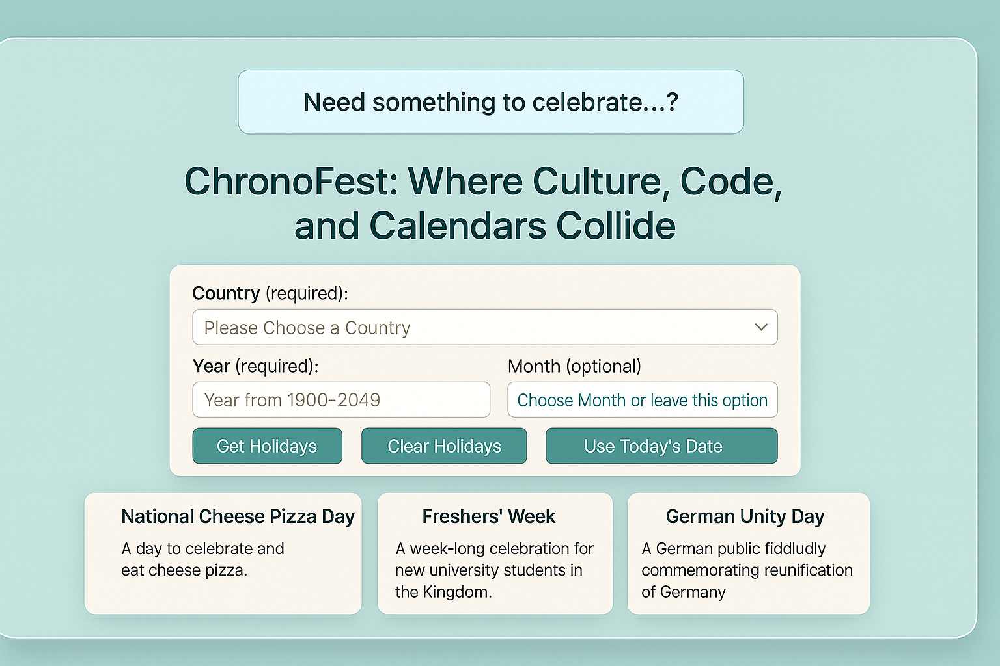

## 🗓️ ChronoFest
To use ChronoFest, you need a Calendarific API key to fetch holiday data. Follow these steps to obtain and insert your API key:-
- Sign Up for Calendarific: Visit [Calendarific](https://calendarific.com/) and create an account.
- Generate an API Key: After signing in, navigate to the API key section in your account dashboard to generate a new API key.
- Copy the API Key: Securely copy the generated API key.
- Insert the API Key: In the `script.js` file, replace `'YOUR_API_KEY'` with your Calendarific API key in the JavaScript section.
- Secure Your Key: Ensure the API key is kept confidential and not exposed in public repositories. For production, consider using environment variables.
- Note: Refer to the [Calendarific API documentation](https://calendarific.com/api/v2) for detailed information on API usage and rate limits.

## 🔍 Overview
Developed "ChronoFest" a responsive web application for exploring global holidays using the Calendarific API. Users can search by country, year, and specific dates, with results displayed in engaging cards. Implemented features like form validation and date shortcuts using JavaScript. The clean UI was built with HTML and CSS, ensuring a user-friendly experience. This project highlights my front-end development skills in creating interactive web applications.

## 📸 Screenshots

## ✨ Features
- ✅ Dynamic Holiday Search: Fetch holidays by country, year, and optional month/day filters.
- 📅 Flexible Date Selection: Choose specific dates or use the "Today's Date" button for quick access.
- 🗑️ Clear Results: Reset form inputs and holiday results with a single click.
- 🎨 Modern UI: Gradient backgrounds, card-based layout, and subtle animations for an engaging experience.
- 📱 Responsive Design: Adapts seamlessly to mobile and desktop devices.
- 🔒 Security Features: Prevents right-click, developer tools access, and dragging for enhanced protection.

## 🧠 How It Works
- Fetches holiday data based on user inputs for country, year, month, and day.
- Ensures valid country and year inputs, with checks for February leap years and 30-day months.
- Renders holidays in a card-based layout with details like name, date, type, and description.
- Automatically populates the form with the current date.
- Clears form inputs and displayed holidays.
- Displays alerts for invalid inputs or no holidays found.

## 🛠️ Built With
- HTML5: Semantic structure and form handling.
- CSS3: Gradient backgrounds, responsive design, and card styling.
- JavaScript (ES6+): Core logic, API integration, and DOM manipulation.
- Font Awesome: Social media icons for the footer (fontawesome.com).
- Calendarific API: Holiday data retrieval (calendarific.com).

## 🧰 Getting Started
- To run ChronoFest locally:
- Clone the Repository: git clone https://github.com/Poorna-Sai-Sriharsha/ChronoFest.git
- Navigate to the Project Directory: cd ChronoFest
- Insert Your API Key: Replace `'YOUR_API_KEY'` in the `script.js` file with your Calendarific API key.
- Open the Application: Launch `index.html` in a browser or use a local server (e.g., `npx live-server`) for the best experience.
- Note: No additional dependencies are required, as all libraries are included via CDNs.

## 🧪 Testing
- Tested for compatibility across Chrome, Firefox, Safari, and Edge.
- Verified responsive design on mobile (iOS, Android) and desktop devices.
- Validated form inputs and API responses for accuracy.

## 📖 What I Learned
- Mastered Calendarific API integration for fetching and displaying holiday data.
- Implemented responsive design with CSS flexbox and media queries.
- Enhanced skills in form validation, error handling, and dynamic UI updates.
- Developed security measures to restrict developer tools and protect application integrity.
- Improved proficiency in asynchronous JavaScript and DOM manipulation.

## 🤝 Contributing
Contributions are welcome! Please fork the repository and submit a pull request with your changes. For major updates, open an issue first to discuss your ideas.

*Note*: Ensure your API key is kept secure and not shared publicly. For further details on the Calendarific API, refer to their official documentation.
